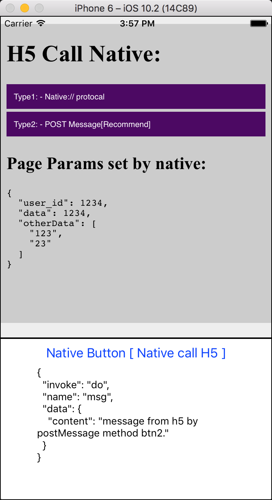

# rn-module-webview-bridge
> Rn module webview bridge.

## h5 call native:
```js
function callNative(inData){
  window.postMessage( JSON.stringify(inData) )
}

btn2.addEventListener('click', (e) => {
  callNative({
    invoke:'do',
    name:'msg',
    data:{
      content:'message from h5 by postMessage method btn2.'
    }
  });
});

```


## native call h5:
```js
const { webview } = this.refs;
webview.injectJavaScript('window.h5Method()')
```

## set query data:
```js
_onLoadStart = e => {
  const { webview } = this.refs;
  const webviewParams = {
      user_id:1234,
      data:1234,
      otherData:['123','23']
  };
  webview.injectJavaScript(`window.__PARAMS__ =${JSON.stringify(webviewParams)}`);
}
```

## resources:
+ https://facebook.github.io/react-native/releases/next/docs/webview.html

## demo:


