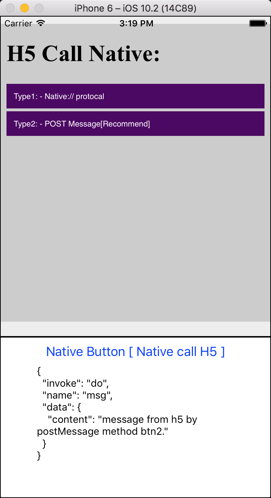

# rn-module-webview-bridge
> Rn module webview bridge.

## h5 call native:
```js
function callNative(inData){
  window.postMessage( JSON.stringify(inData) )
}

btn2.addEventListener('click', (e) => {
  callNative({
    invoke:'do',
    name:'msg',
    data:{
      content:'message from h5 by postMessage method btn2.'
    }
  });
});

```


## native call h5:
```js
const { webview } = this.refs;
webview.injectJavaScript('window.h5Method()')
```

## resources:

## demo:


